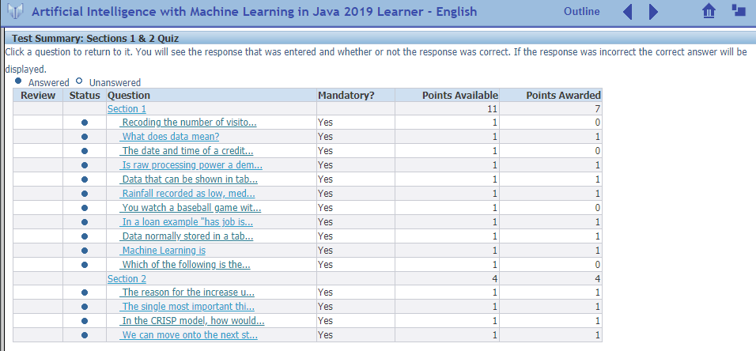
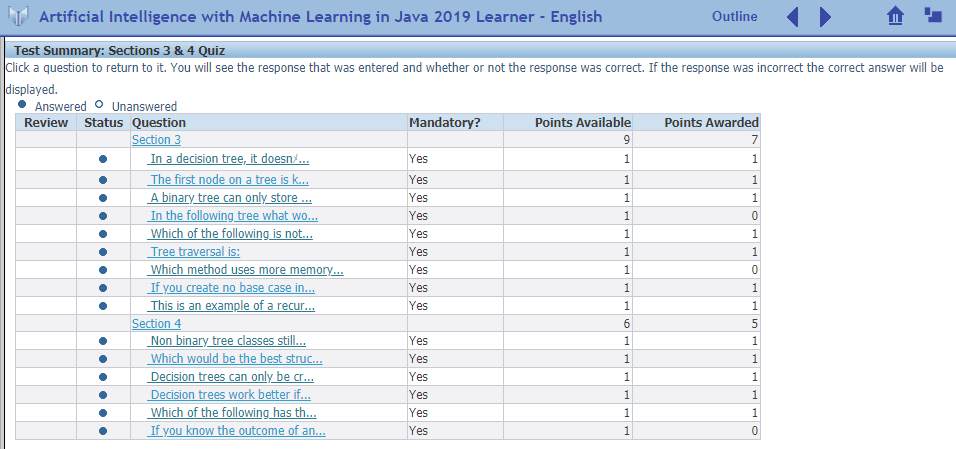
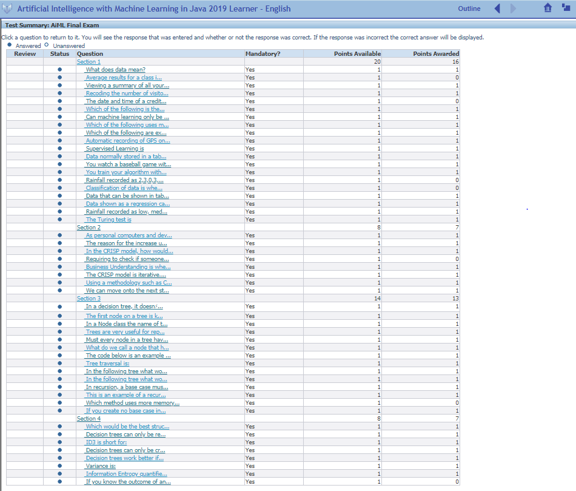

# AIPersonalProject

### TASK: Research Moore's Law

##### When was it introduced?
Moore's Law was introduced in a 1965 paper by Gordon Moore, the co-founder of Fairchild 
Semiconductors and CEO of Intel.

##### How has it accurately modelled previous development?
Moore's Law states that number of transistors in dense integrated circuits doubles about
every 2 years. This prediction has proven to be accurate since its inception and is used
to guide long-term planning in the semiconductor industry.

##### Do you think this can continue into the future?
So far Moore's Law has proven to be incredibly accurate and therefore for the near future
I would image it will continue to remain true. However, I can imagine that eventually we
will reach a point where it won't be possible to increase the number of transistors at the
same rate.

### Section 3-1 TASK

##### What is the parent of 6?
The parent of 6 is 3.

##### What is 1 the parent of?
1 is the parent of 2 and 3.

##### Explain the relationships of 5.
5 is the child of 2, the sibling of 4 and the parent of 7.

### Section 3-2 TASK: Can you think of problems that could result from this (recursion)?
Recursive calls can eventually lead to a stack overflow if the base case is not reached 
before the program runs out of memory. 

### Quiz 1

### Quiz 2

### Final Exam

